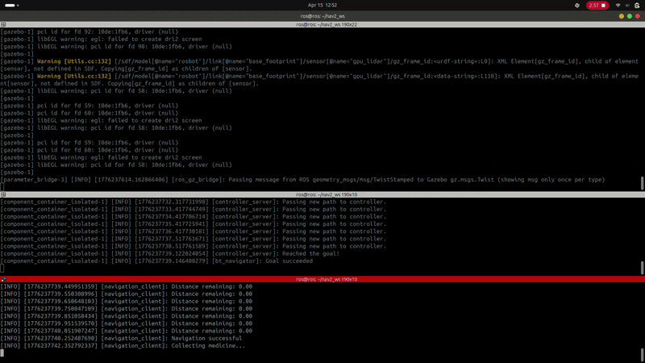
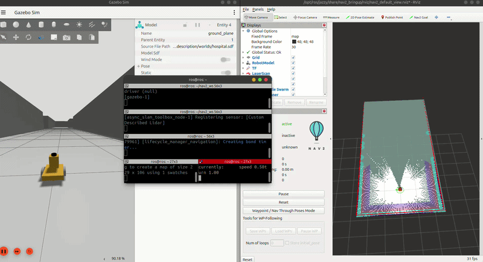

# Autonomous Medicine Delivery Robot (ROS 2 + Gazebo)
 

## Overview

This project simulates an **Autonomous Medicine Delivery Robot** in **Gazebo** using **ROS 2**. The robot navigates inside a **three-room hospital environment**.

- **Room 1:** Medicine Storage Room  
- **Room 2:** Patient Room A  
- **Room 3:** Patient Room B  

The robot performs the following tasks:

1. Starts from home position  
2. Moves to medicine room  
3. Collects medicine (simulation)  
4. Delivers to Patient Room A  
5. Delivers to Patient Room B  
6. Returns to home position  

---

## Features

- Autonomous navigation using Nav2
- Multi-room delivery system
- Return to home position
- Gazebo simulation
- ROS 2 integration
- Path planning and obstacle avoidance

---

## Requirements

- Ubuntu 22.04 / 20.04 / 24.04
- ROS 2 Humble / Foxy / jazzy
- Gazebo
- Nav2
- Python / C++

---

### Simulation commads for medicine delivery
```sh
ros2 launch rosbot_description gazebo.launch.py

ros2 launch rosbot_nav2_bringup nav2.launch.py

ros2 run nav2_client navigation_client
```
### Simulation commads for manual mapping
```sh
ros2 launch rosbot_description gazebo.launch.py

ros2 launch slam_toolbox online_async_launch.py use_sim_time:=True

ros2 launch nav2_bringup bringup_launch.py use_sim_time:=True

rviz2
```